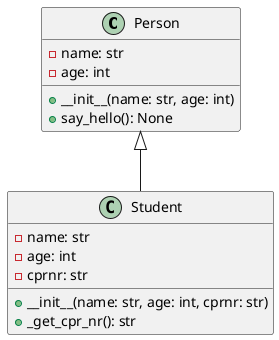

# Introduktion til Objekt-orienteret programmering i Python 

## Af Henrik Sterner (henrik.sterner@gmail.com)


# Om brugen af disse slides
- Disse slides forsøger at eksemplifere en lang række af de vigtige begreber i Python
- De må på ingen måde kopieres uden tilladelse fra Henrik Sterner
- De er lavet i markdown og kan derfor nemt konverteres til andre formater
- Ved brug af Visual Studio Code kan de konverteres til HTML, PDF, PowerPoint, Word, LaTeX og mange andre formater 
- Slides er tilgængelige på github.com/henriksterner/IntroPython/


# Konvertere slides til andre formater

- Fra markdown til pdf ved brug af pandoc: 
```bash 
pandoc -t beamer -o slides_oop_python.pdf slides_oop_python.md
```
- Fra markdown til word ved brug af pandoc: 
```bash 
pandoc -t docx -o slides_oop_python.docx slides_oop_python.md
```

- Fra markdown til pdf hvor sektioner tilføjes som hovedpunkter i pdf'en:
```bash
pandoc -t beamer -o slides_oop_python.pdf slides_oop_python.md --toc
```

# Hvad er objekt-orienteret programmering?
- En måde at tænke og strukturere programmering på
- Gør det muligt at skabe genbrugelige og vedligeholdbare programmer
- Kan bruges til at implementere komplekse systemer
- Bruges i stort set alle moderne programmeringssprog
- Giver mulighed for at arbejde med abstraktioner og modellering af virkeligheden
- Mest anvendte paradigme i moderne programmering

# Hvad er et objekt og en klasse?
- Et objekt er en instans af en klasse
- En klasse er en skabelon for et objekt
- En klasse kan have attributter (egenskaber) og metoder (funktioner)
  
# Eksempel på en klasse
```python
class Person:
    def __init__(self, name, age):
        self.name = name
        self.age = age

    def say_hello(self):
        print(f'Hello, my name is {self.name} and I am {self.age} years old')
```
Klassen `Person` har to attributter `name` og `age` og en metode `say_hello`. 

# Eksempel på brug af klassen
```python
p1 = Person('Alice', 25)
p2 = Person('Bob', 30)

p1.say_hello()
p2.say_hello()
```
Output:
```
Hello, my name is Alice and I am 25 years old
Hello, my name is Bob and I am 30 years old
```
Vi bemærker, at vi har to forskellige instanser af klassen `Person` med forskellige værdier for attributterne `name` og `age`.

# Konstruktør: `__init__`
- Konstruktøren `__init__` er en speciel metode, der kaldes, når et objekt af klassen oprettes
- Konstruktøren bruges til at initialisere objektets attributter
- Konstruktøren kaldes automatisk, når et objekt oprettes
- Konstruktøren kaldes med `self` som første argument
- `self` refererer til objektet selv og bruges til at tilgå objektets attributter og metoder

# Eksempel på konstruktør
```python
class Person:
    def __init__(self, name, age):
        self.name = name
        self.age = age
```
Konstruktøren initialiserer attributterne `name` og `age` med værdierne `name` og `age`.

# Eksempel på brug af konstruktør
```python
p1 = Person('Alice', 25)
p2 = Person('Bob', 30)
```
Vi opretter to instanser af klassen `Person` med forskellige værdier for attributterne `name` og `age`.

# Eksempel på en anden konstruktør
```python
class Car:
    def __init__(self, make, model, year):
        self.make = make
        self.model = model
        self.year = year
```
Konstruktøren initialiserer attributterne `make`, `model` og `year` med værdierne `make`, `model` og `year`.

# Eksempel på brug af konstruktør
```python
c1 = Car('Ford', 'Mustang', 1964)
c2 = Car('Tesla', 'Model S', 2021)
```
Vi opretter to instanser af klassen `Car` med forskellige værdier for attributterne `make`, `model` og `year`.

# Eksempel på en konstruktør uden argumenter
```python
class Dog:
    def __init__(self):
        self.name = 'Fido'
        self.age = 1
```
Konstruktøren initialiserer attributterne `name` og `age` med standardværdierne `'Fido'` og `1`.

# Eksempel på brug af konstruktør uden argumenter
```python
d1 = Dog()
d2 = Dog()
```
Vi opretter to instanser af klassen `Dog` med standardværdierne for attributterne `name` og `age`.

# Klasse med konstruktører med og uden argumenter
```python
class Dog:
    def __init__(self, name='Fido', age=1):
        self.name = name
        self.age = age
```
Konstruktøren initialiserer attributterne `name` og `age` med standardværdierne `'Fido'` og `1`.


# Attributter og metoder
- Attributter er egenskaber ved et objekt
- Metoder er funktioner, der kan tilgå og ændre attributterne
- Attributter og metoder tilgås ved brug af punktnotation
- Attributter og metoder kan være offentlige eller private (protected findes ikke i Python)
- Offentlige attributter og metoder kan tilgås fra andre klasser
- Private attributter og metoder kan kun tilgås fra klassen selv
- Private attributter og metoder angives ved at starte navnet med en underscore `_`
- Private attributter og metoder kan tilgås fra andre klasser

# Eksempel på en klasse med offentlige attributter og metoder
```python
class Student:
    def __init__(self, name, age):
        self.name = name
        self.age = age

    def say_hello(self):
        print(f'Hello, my name is {self.name} and I am {self.age} years old')
```
Attributterne `name` og `age` og metoden `say_hello` er offentlige.

# Eksempel på en klasse med private attributter og metoder
Vi tilføjer en attribut `cprnr` som bliver privat ved at starte navnet med en underscore `_`.
```python
class Student:
    def __init__(self, name, age, cpr_nr):
        self.name = name
        self.age = age
        self._cprnr = cprnr

    def _get_cpr_nr(self):
        return self._cprnr
```

# Oprette en student
```python
if _name_ == '_main_':
    s1 = Student('Alice', 25, '123456-7890')
    print(s1.name) # Alice
    print(s1._cprnr) # Fejl, da attributten er privat
    print(s1._get_cpr_nr()) # Fejl, da metoden er privat
```
Bemærk if-testen, der sikrer, at koden kun køres, hvis filen køres som hovedprogram.

# Operator overloading
- Python tillader operator overloading
- Dette betyder, at operatører som `+`, `-`, `*`, `/` og `==` kan tilpasses til at virke med brugerdefinerede klasser
- Dette gøres ved at tilføje specielle metoder til klassen
- Disse metoder kaldes, når operatørerne bruges på objekter af klassen
- Eksempler på specielle metoder er `__add__`, `__sub__`, `__mul__`, `__truediv__` og `__eq__`
- Se https://docs.python.org/3/reference/datamodel.html#emulating-numeric-types for en komplet liste
- Disse metoder kaldes automatisk, når operatørerne bruges på objekter af klassen

# Eksempel på operator overloading
```python
class Point:
    def __init__(self, x, y):
        self.x = x
        self.y = y

    def __add__(self, other):
        return Point(self.x + other.x, self.y + other.y)

    def __eq__(self, other):
        return self.x == other.x and self.y == other.y
```
Vi tilføjer metoderne `__add__` og `__eq__` til klassen `Point`.

# Brug af operator overloading
```python
p1 = Point(1, 2)
p2 = Point(3, 4)
p3 = p1 + p2
print(p3.x, p3.y) # 4 6
print(p1 == p2) # False
print(p1 == Point(1, 2)) # True
```
Vi bruger metoderne `__add__` og `__eq__` til at tilføje to punkter og sammenligne to punkter.


# Nedarvning
- Nedarvning er en måde at opbygge klasser på
- En klasse kan nedarve fra en anden klasse
- Den nedarvende klasse kaldes en underklasse
- Den nedarvede klasse kaldes en superklasse
- En underklasse arver attributter og metoder fra superklassen
- En underklasse kan tilføje nye attributter og metoder og ændre eksisterende metoder
- En underklasse kan også tilføje en konstruktør, der kaldes superklassens konstruktør

# Eksempel på nedarvning
```python
class Animal:
    def __init__(self, name):
        self.name = name

    def speak(self):
        pass

class Dog(Animal):
    def speak(self):
        return 'Woof'
```
Vi opretter en superklasse `Animal` og en underklasse `Dog`, der nedarver fra superklassen.

# Brug af nedarvning
```python
a1 = Animal('Fido')
d1 = Dog('Rex')
print(a1.name) # Fido
print(d1.name) # Rex
print(a1.speak()) # None
print(d1.speak()) # Woof
```
Vi opretter instanser af superklassen `Animal` og underklassen `Dog` og kalder metoderne `speak`.

# Hvad med super?
- `super` er en indbygget funktion, der bruges til at kalde metoder fra superklassen
- `super` bruges i konstruktøren for at kalde superklassens konstruktør
- `super` bruges også til at kalde superklassens metoder
- `super` bruges i stedet for at bruge superklassens navn direkte

# Eksempel på brug af super
```python
class Animal:
    def __init__(self, name):
        self.name = name

    def speak(self):
        pass

class Dog(Animal):
    def __init__(self, name, breed):
        super().__init__(name)
        self.breed = breed

    def speak(self):
        return 'Woof'
```
Vi bruger `super` til at kalde superklassens konstruktør i underklassens konstruktør.

# Brug af super
```python
d1 = Dog('Rex', 'Labrador')
print(d1.name) # Rex
print(d1.breed) # Labrador
print(d1.speak()) # Woof
```
Vi opretter en instans af underklassen `Dog` og kalder metoderne `speak`.

# Abstrakte klasser
- En abstrakt klasse er en klasse, der ikke kan oprettes
- En abstrakt klasse bruges som skabelon for andre klasser
- En abstrakt klasse kan have metoder, der ikke er implementeret
- En abstrakt klasse kan have metoder, der skal implementeres i underklasser

# Eksempel på abstrakt klasse
```python
from abc import ABC, abstractmethod

class Animal(ABC):
    def __init__(self, name):
        self.name = name

    @abstractmethod
    def speak(self):
        pass
```
Vi opretter en abstrakt klasse `Animal` med en abstrakt metode `speak`.
Abstrakte klasser importeres fra modulet `abc`.

# Brug af abstrakt klasse
```python
class Dog(Animal):
    def speak(self):
        return 'Woof'

class Cat(Animal):
    def speak(self):
        return
```

# Brug af abstrakt klasse
```python
d1 = Dog('Rex')
c1 = Cat('Whiskers')
print(d1.speak()) # Woof
print(c1.speak()) # Fejl, da metoden ikke er implementeret
```
Vi opretter underklasser `Dog` og `Cat` af abstrakt klassen `Animal` og kalder metoden `speak`.

# Kan vi udvide en abstrakt klasse i børneklassen?
- Ja, vi kan udvide en abstrakt klasse i børneklassen
- Vi kan tilføje attributter og metoder i børneklassen
- Vi kan også tilføje en konstruktør, der kaldes superklassens konstruktør
- Vi kan også tilføje en metode, der skal implementeres i børneklassen

# Eksempel på udvidelse af abstrakt klasse
```python
class Dog(Animal):
    def __init__(self, name, breed):
        super().__init__(name)
        self.breed = breed

    def speak(self):
        return 'Woof'

    def wag_tail(self):
        return 'Wagging tail'
```
Vi udvider abstrakt klassen `Animal` med en konstruktør og en metode `wag_tail`.

# Brug af udvidelse af abstrakt klasse
```python
d1 = Dog('Rex', 'Labrador')
print(d1.name) # Rex
print(d1.breed) # Labrador
print(d1.speak()) # Woof
print(d1.wag_tail()) # Wagging tail
```
Vi opretter en instans af underklassen `Dog` og kalder metoderne `speak` og `wag_tail`.

# Hvad er polymorfi?
- Polymorfi betyder, at en metode kan have forskellige former
- Polymorfi bruges til at implementere metoder, der kan have forskellige implementeringer i underklasser
- Polymorfi bruges til at implementere metoder, der kan tage forskellige typer som argumenter
- Polymorfi bruges til at implementere metoder, der kan returnere forskellige typer
- Polymorfi bruges til at implementere metoder, der kan have forskellige signaturer
  
# Eksempel på polymorfi
```python
class Animal:
    def speak(self):
        pass

class Dog(Animal):
    def speak(self):
        return 'Woof'

class Cat(Animal):
    def speak(self):
        return 'Meow'
```
Vi opretter en superklasse `Animal` og underklasser `Dog` og `Cat`, der nedarver fra superklassen.

# Brug af polymorfi
```python
def make_animal_speak(animal):
    print(animal.speak())

a1 = Animal()
d1 = Dog()
c1 = Cat()
make_animal_speak(a1) # None
make_animal_speak(d1) # Woof
make_animal_speak(c1) # Meow
```
Vi opretter instanser af superklassen `Animal` og underklasserne `Dog` og `Cat` og kalder metoden `speak`.

# Hvad er en statisk metode?
- En statisk metode er en metode, der tilhører klassen og ikke objekterne
- En statisk metode kaldes med klassen som argument og ikke objektet
- En statisk metode kan tilgås fra klassen og ikke objekterne
- En statisk metode bruges til at implementere metoder, der ikke tilgår objektets attributter
- En statisk metode angives ved at bruge dekoratoren `@staticmethod`
- En statisk metode kaldes med klassen som argument og ikke objektet

# Eksempel på statisk metode
```python
class Math:
    @staticmethod
    def add(x, y):
        return x + y

    @staticmethod
    def subtract(x, y):
        return x - y
```
Vi opretter en klasse `Math` med statiske metoder `add` og `subtract`.

# Brug af statisk metode
```python
print(Math.add(2, 3)) # 5
print(Math.subtract(5, 3)) # 2
```
Vi kalder de statiske metoder `add` og `subtract` fra klassen `Math`.

# Hvad er en klasse metode?
- En klasse metode er en metode, der tilhører klassen og ikke objekterne
- En klasse metode kaldes med klassen som argument og ikke objektet
- En klasse metode kan tilgås fra klassen og ikke objekterne
- En klasse metode bruges til at implementere metoder, der tilgår klassens attributter

# Eksempel på klasse metode
```python
class Person:
    count = 0

    def __init__(self, name):
        self.name = name
        Person.count += 1

    @classmethod
    def get_count(cls):
        return cls.count
```
Vi opretter en klasse `Person` med en klasse metode `get_count`.

# Brug af klasse metode
```python
p1 = Person('Alice')
p2 = Person('Bob')
print(Person.get_count()) # 2
```
Vi opretter instanser af klassen `Person` og kalder metoden `get_count` fra klassen `Person`.

# Klasser vs. moduler
- Klasser bruges til at opbygge objekter
- Moduler bruges til at opbygge programmer
- Klasser bruges til at opbygge objekter, der har attributter og metoder
- Moduler bruges til at opbygge programmer, der har funktioner og konstanter
- Klasser bruges til at opbygge objekter, der kan nedarve fra andre klasser
- Moduler bruges til at opbygge programmer, der kan importeres i andre moduler

# Et modul af klasser
```python
# person.py
class Person:
    def __init__(self, name, age):
        self.name = name
        self.age = age

    def say_hello(self):
        print(f'Hello, my name is {self.name} and I am {self.age} years old')   
```
Vi opretter en klasse `Person` i modulet `person`.

# Brug af modul af klasser
```python
from person import Person

p1 = Person('Alice', 25)
p2 = Person('Bob', 30)

p1.say_hello()
p2.say_hello()
```
Vi importerer klassen `Person` fra modulet `person` og opretter instanser af klassen. Forudsætter, at `person.py` findes i samme mappe som hovedprogrammet.
Hvis `person.py` findes i en undermappe, kan vi bruge `from folder.person import Person`.

# Decorators - hvad er det?
- En decorator er en funktion, der tager en anden funktion som argument
- En decorator bruges til at udvide funktionaliteten af en funktion
- En decorator bruges til at tilføje funktionalitet til en funktion uden at ændre funktionen
- En decorator bruges til at tilføje funktionalitet til en klasse eller metode uden at ændre klassen eller metoden

# Simpelt eksempel på decorator
```python
def my_decorator(func):
    def wrapper():
        print('Something is happening before the function is called.')
        func()
        print('Something is happening after the function is called.')
    return wrapper

def say_hello():
    print('Hello!')

say_hello = my_decorator(say_hello)
```
Vi opretter en decorator `my_decorator` og dekorerer funktionen `say_hello`.

# Brug af decorator
```python
say_hello()
```
Vi kalder funktionen `say_hello`, der er dekoreret med `my_decorator`.
Resultatet bliver:
```
Something is happening before the function is called.
Hello!
Something is happening after the function is called.
```

# Decorator med `@`-notation
```python
def my_decorator(func):
    def wrapper():
        print('Something is happening before the function is called.')
        func()
        print('Something is happening after the function is called.')
    return wrapper

@my_decorator
def say_hello():
    print('Hello!')
```
Vi dekorerer funktionen `say_hello` med `my_decorator` ved brug af `@`-notation.

# Brug af decorator med `@`-notation
```python
say_hello()
```
Vi kalder funktionen `say_hello`, der er dekoreret med `my_decorator`.
Resultatet bliver:
```python
Something is happening before the function is called.
Hello!
Something is happening after the function is called.
```

# Decorator med argumenter
```python
def my_decorator(func):
    def wrapper(*args, **kwargs):
        print('Something is happening before the function is called.')
        func(*args, **kwargs)
        print('Something is happening after the function is called.')
    return wrapper

@my_decorator
def say_hello(name):
    print(f'Hello, {name}!')
```
Vi dekorerer funktionen `say_hello` med `my_decorator` og tilføjer argumenter til `wrapper`.

# Brug af decorator med argumenter
```python
say_hello('Alice')
```
Vi kalder funktionen `say_hello`, der er dekoreret med `my_decorator`.
Resultatet bliver:
```python
Something is happening before the function is called.
Hello, Alice!
Something is happening after the function is called.
```

# Decorator med argumenter
```python
def my_decorator(prefix):
    def decorator(func):
        def wrapper(*args, **kwargs):
            print(f'{prefix}: Something is happening before the function is called.')
            func(*args, **kwargs)
            print(f'{prefix}: Something is happening after the function is called.')
        return wrapper
    return decorator

@my_decorator('DEBUG')
def say_hello(name):
    print(f'Hello, {name}!')
```
Vi opretter en decorator `my_decorator` med argumenter og dekorerer funktionen `say_hello`.

# Brug af decorator med argumenter
```python
say_hello('Alice')
```
Vi kalder funktionen `say_hello`, der er dekoreret med `my_decorator`.
Resultatet bliver:
```python
DEBUG: Something is happening before the function is called.
Hello, Alice!
DEBUG: Something is happening after the function is called.
```

# Klassediagrammer
- Et klassediagram er en grafisk repræsentation af klasser og deres relationer
- Et klassediagram viser klasser, attributter og metoder
- Et klassediagram viser relationer mellem klasser
- Et klassediagram viser nedarvning, association, aggregering og komposition
- Et klassediagram viser offentlige og private attributter og metoder

# Et generisk klassediagram




